# Active-Directory-Home-Lab
Built a Windows Server Active Directory environment with domain-joined Windows clients.

- Downloaded Oracle VirtualBox and setup Windows Server and Windows client VM's.
- Setup an internal network so the server and clients could communicate. 
- Setup a static IP address and had the server point the DNS to itself.
- Installed Active Directory Domain Services and promoted the server to Domain Controller.
- Created Organizational Units, User Accounts, and Security Groups.
- Joined the client PC to the domain and tested domain login.
- Created and modified Group Policies such as Password Policy, Security Policy, and logon scripts
- Practiced help desk scenarios such as disabling users, resetting passwords, unlocking accounts, changing permissions, and software deployment.
- Performed troubleshooting using tools such as gpupdate, gpresult, ping, ipconfig, nslookup.

## Setup and Installation
Performed a setup of VMs and installation of Windows Server and Windows 11 clients. For the server, this required cleaning the disk using diskpart to free up space which allowed Windows Server to install.

## Network Setup
Configured the server and client VM network settings to enable a second adapter for an internal network. Configured the server network configuration to set the static IP address: 192.168.10.10. The client machine IP address was set to 192.168.10.20 to ensure the server and client were on the same local network. The server and client machines were both configured to have the DNS point to the server IP.

## Active Directory and DNS Server Setup
Installed Active Directory Domain Services and DNS Server. Promoted the server to a domain controller and gave it the domain name: campbell.local.

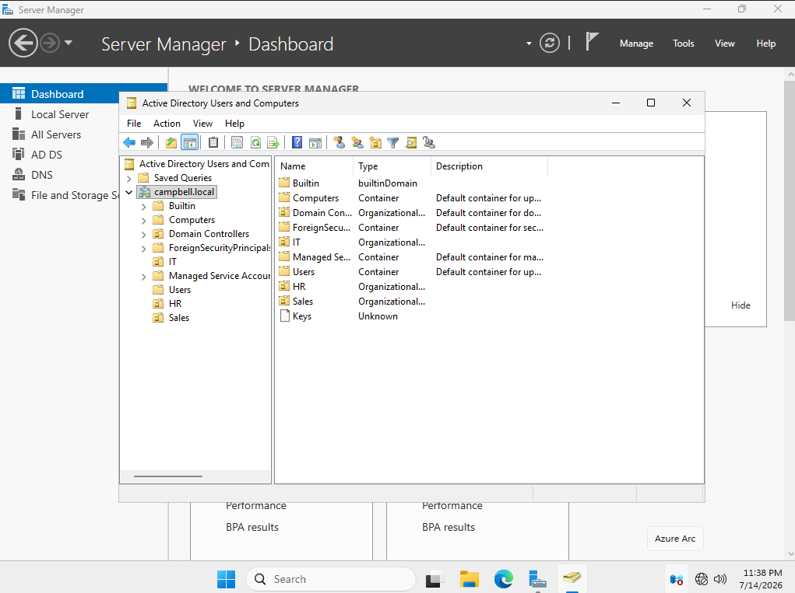

## OU, User Account, and Security Group Creation
Opened AD Users and Computers and created the Organizational Units: Users, Computers, IT, HR, and Sales. Selected the Users OU and entered example users, inputting their full name, username, and default password to be changed upon first login. Selected the IT OU and created several security groups: IT Admins, Help Desk, Managers, Employees. Added a user to the Help Desk group.

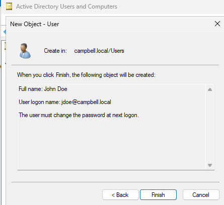
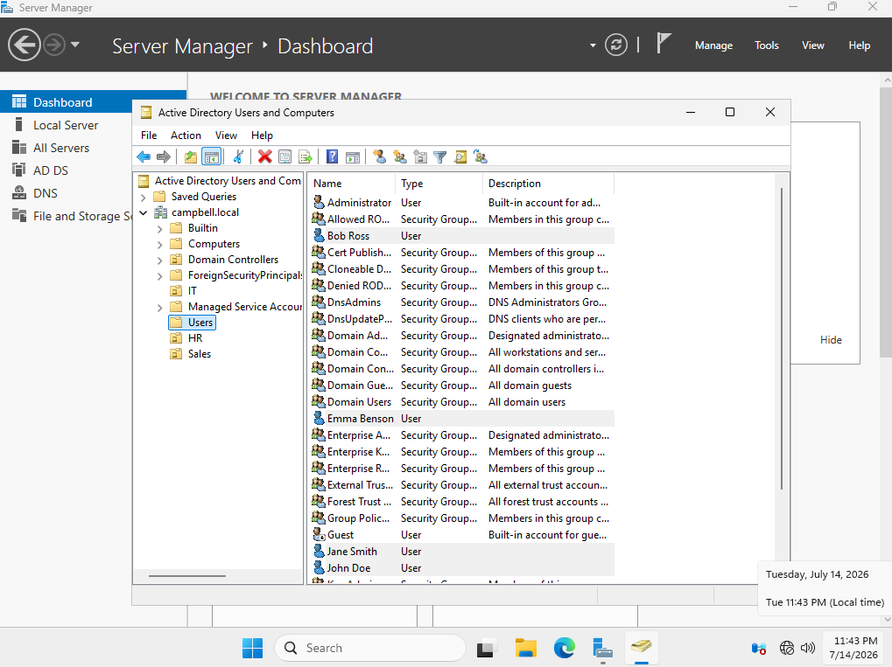
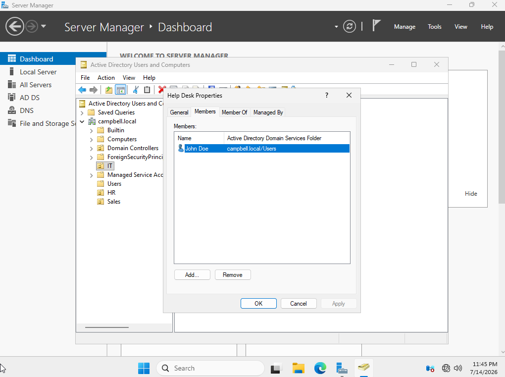

## Join Client PC to Domain and Test Login
Joined the device to the local active directory network: campbell.local. Restarted client machine and selected other user on login. Entered the user's username and password to successfully login.

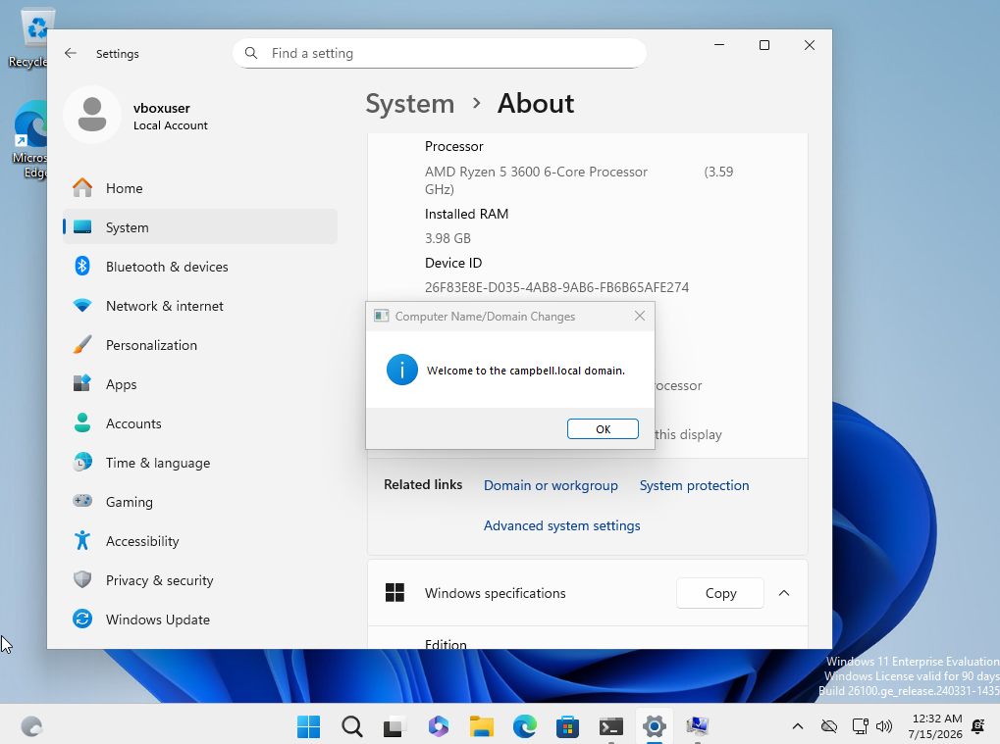
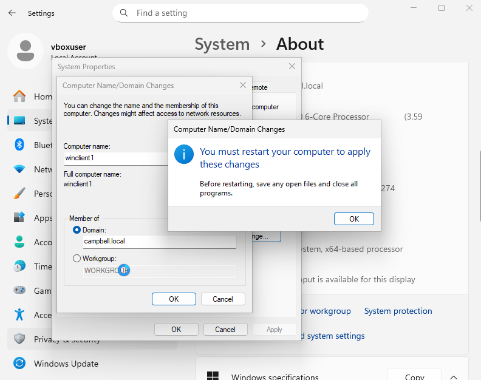
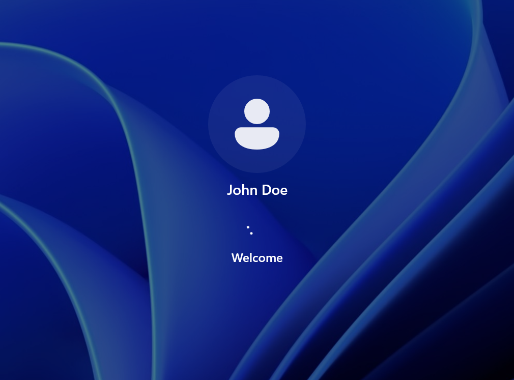

## Group Policy Objects
Opened the Group Policy Management Editor and configured group policy settings such as password policy, security policy, and logon scripts.

### Password Policy
Setup a password policy and configured password history, age, and length requirements. 

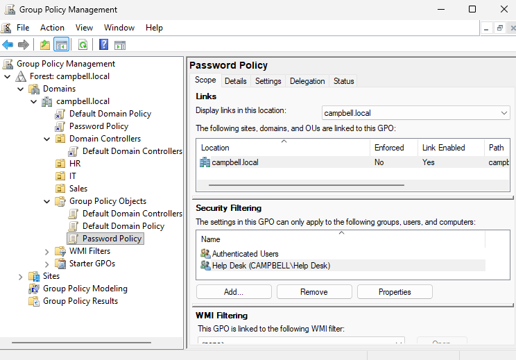
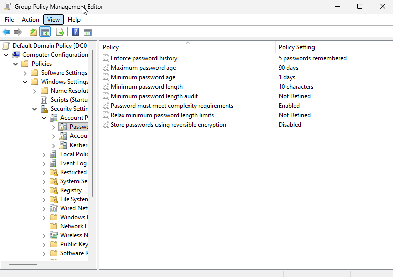

### Security Policy
Setup a security policy and configured the lockout restrictions. 

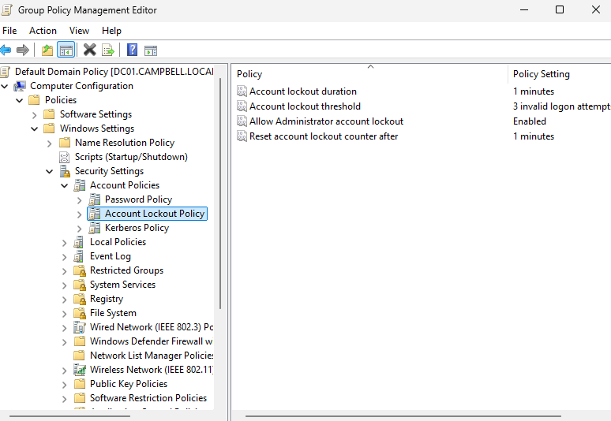
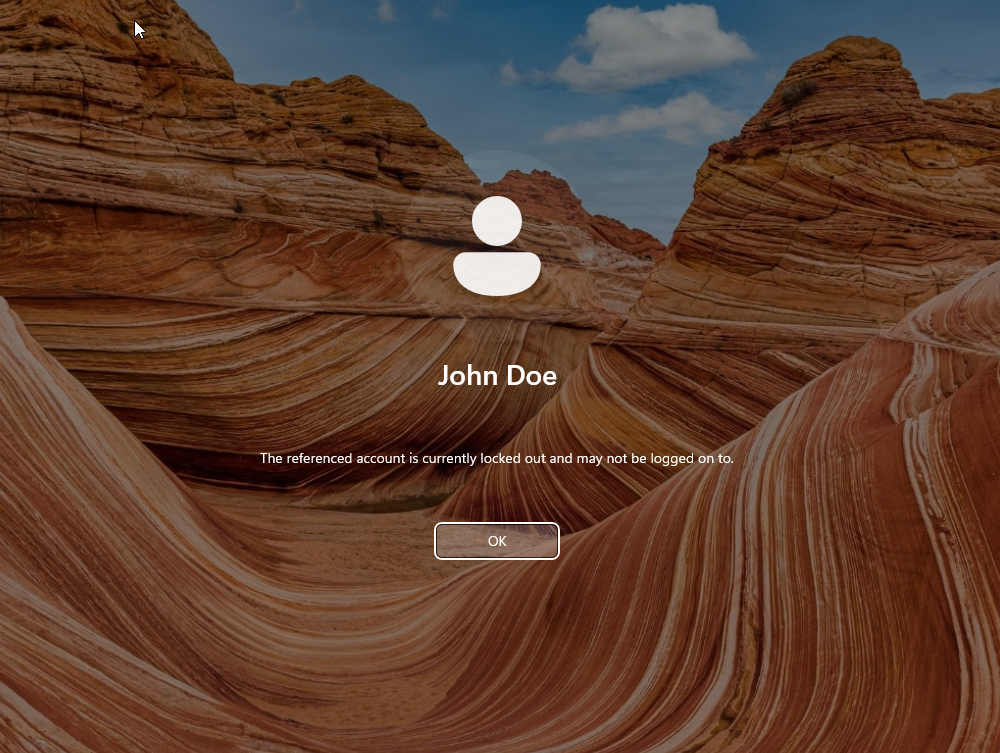
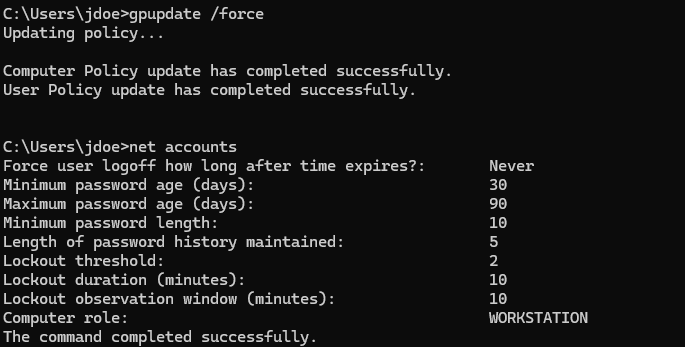

### Logon Script
Wrote a script to map a network drive upon user login. Configured the logon script group policy object by applying the script in the logon properties. Applied the group policy object to the HR group.

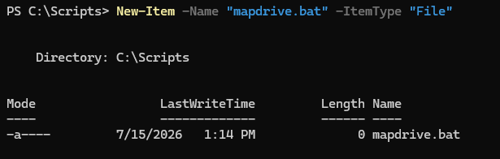
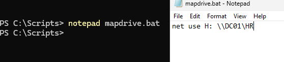
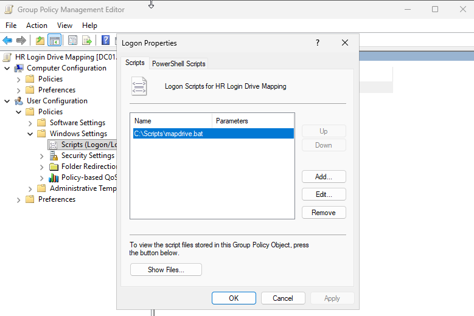
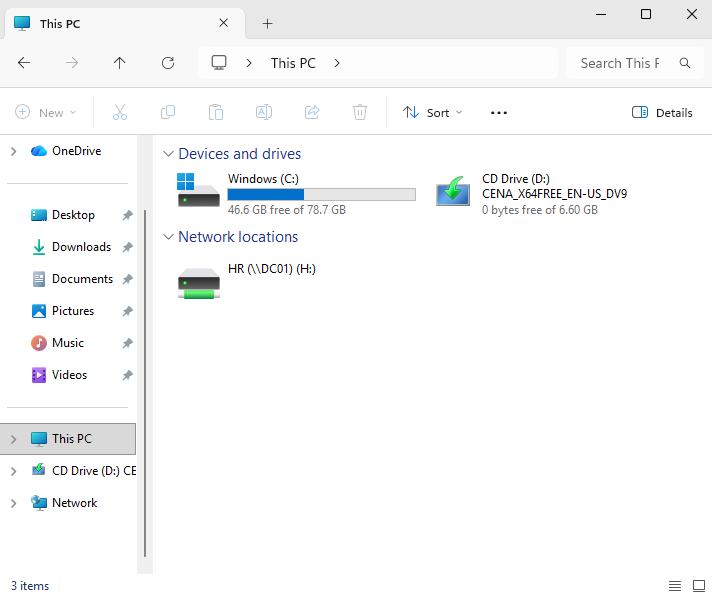

## Help Desk Scenarios and Troubleshooting
Practiced help desk scenarios to simulate actual problems and tasks. This helped to strengthen understanding concepts and routines that may be seen in the work place. Troubleshot user accounts, permissions, software installation, and other issues encountered throughout the project.

### User Account Troubleshooting
Messed around with disabling a user account, resetting passwords, and unlocking a user account.

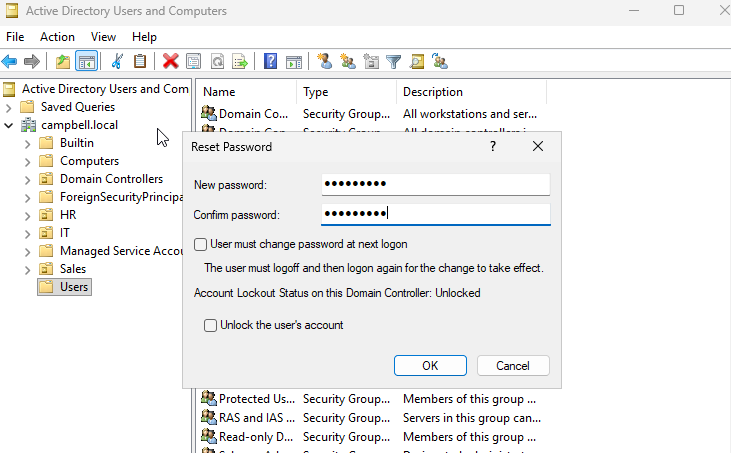

### NTFS Permissions

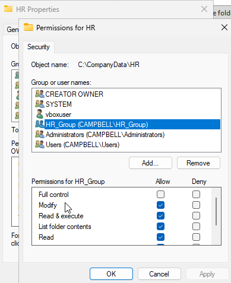
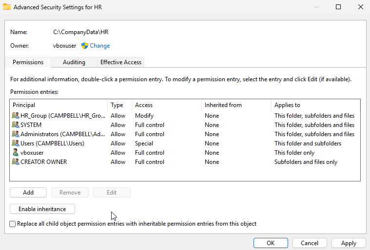
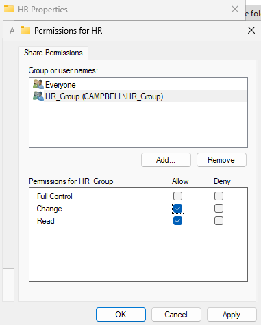

