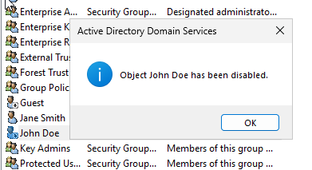
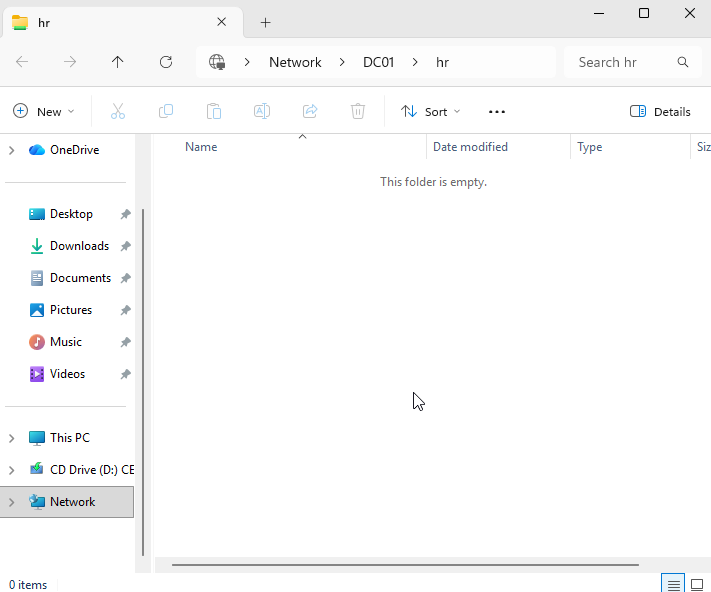
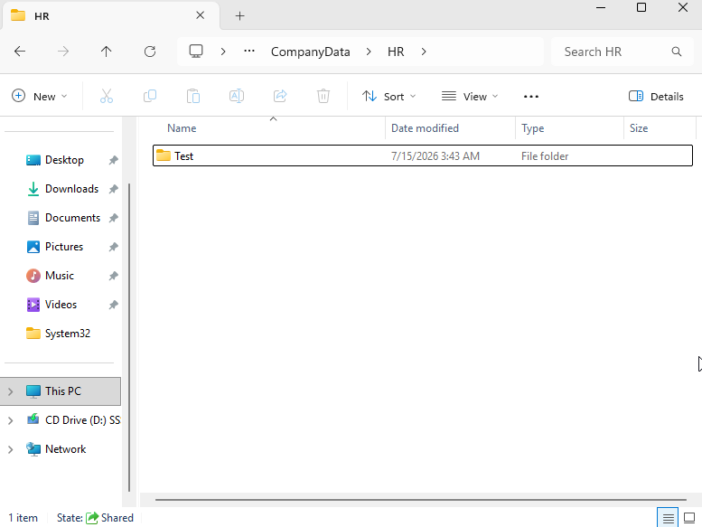
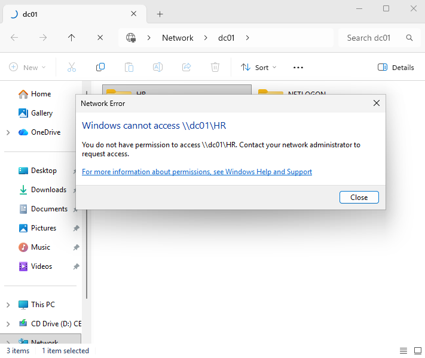
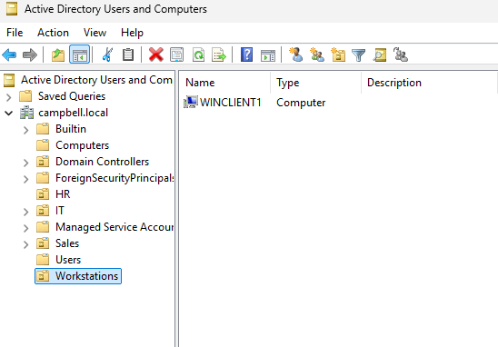
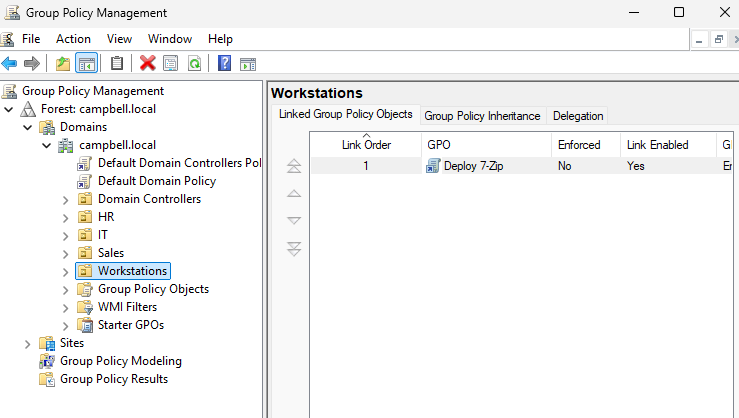
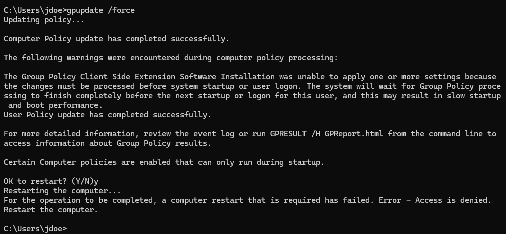
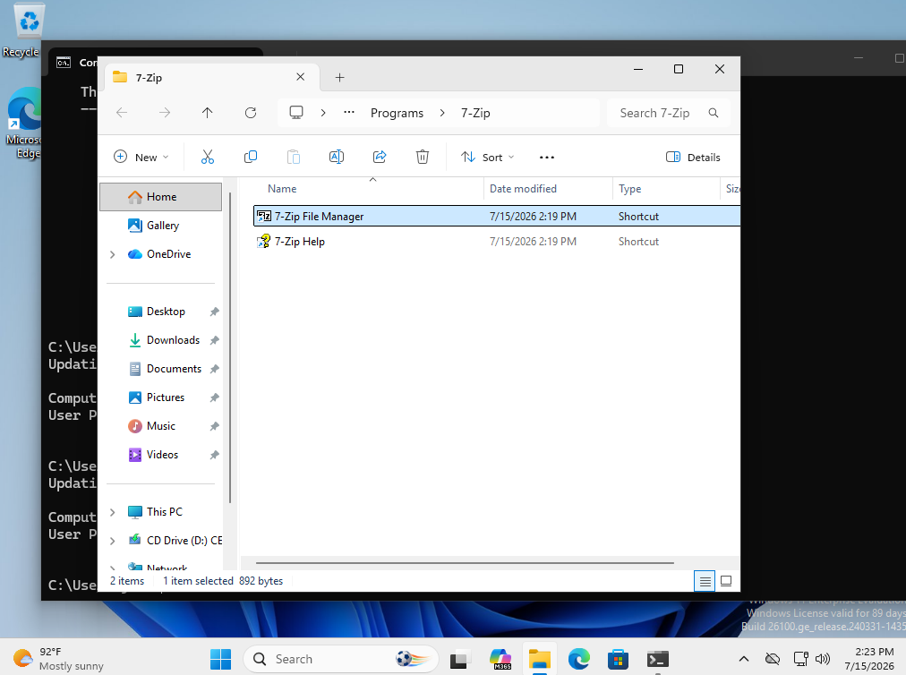
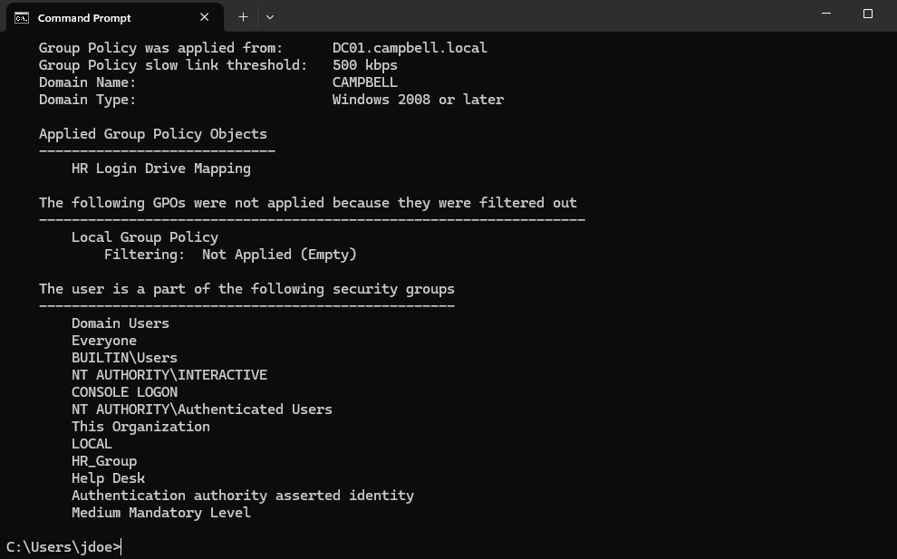

# Active-Directory-Home-Lab

## Project Overview
This Active Directory home lab simulates a small enterprise Windows domain environment using virtual machines. The environment was built to practice common Windows Server administration, Active Directory management, Group Policy, DNS, file sharing, and troubleshooting tasks.

## Active Directory Components

The following Windows Server roles, features, and Active Directory components were configured during this lab:

- Active Directory Domain Services (AD DS)
- Domain Name System (DNS)
- Group Policy Management
- Organizational Units (OUs)
- Security Groups
- Domain User Accounts
- Domain-Joined Windows 11 Client
- Shared Network Folders
- NTFS Permissions
- SMB File Sharing
- Software Deployment via Group Policy

## Common Administrative Tasks Demonstrated

Throughout this lab, I completed the following administrative tasks:

- Installed and configured Windows Server 2022
- Promoted a server to a Domain Controller
- Configured Active Directory Domain Services (AD DS)
- Configured DNS for Active Directory
- Assigned a static IPv4 address to the Domain Controller
- Created and managed domain users
- Created and managed Active Directory Security Groups
- Created Organizational Units (OUs)
- Joined a Windows 11 client to the domain
- Configured and managed Group Policy Objects (GPOs)
- Implemented password and account lockout policies
- Configured Logon Script
- Created shared folders for department resources
- Configured NTFS and Share permissions
- Applied Role-Based Access Control (RBAC) using Security Groups
- Mapped network drives with Group Policy
- Deployed MSI software using Group Policy Software Installation
- Verified Group Policy application using `gpresult` and `gpupdate`
- Troubleshot Active Directory, DNS, SYSVOL, and Group Policy issues using:
  - `gpupdate`
  - `gpresult`
  - `dcdiag`
  - `nslookup`
  - `ipconfig`
  - `nltest`
  - `ping`


## Network Configuration

| Device | IP Address | Purpose |
|---------|------------|---------|
| DC01 | 192.168.10.10 | Domain Controller, DNS Server |
| WIN11-CLIENT | 192.168.10.20 | Domain-joined Windows workstation |

Domain: `campbell.local`

DNS Server: `192.168.10.10`

## Network Diagram

```text
                   Internet
                       │
                  Router / NAT
                       │
        ┌──────────────┴──────────────┐
        │                             │
   DC01 (Windows Server)         WIN11-CLIENT
   192.168.10.10                 192.168.10.20
   AD DS • DNS • GPO             Domain Joined

            Domain: campbell.local
```

## Implementation

### Setup and Installation
Performed a setup of VMs and installation of Windows Server and Windows 11 clients. For the server, this required cleaning the disk using diskpart to free up space which allowed Windows Server to install.


### Network Setup
Configured the server and client VM network settings to enable a second adapter for an internal network. Configured the server network configuration to set the static IP address: `192.168.10.10`. The client machine IP address was set to `192.168.10.20` to ensure the server and client were on the same local network. The server and client machines were both configured to have the DNS point to the server IP.


### Active Directory and DNS Server Setup
Installed Active Directory Domain Services and DNS Server. Promoted the server to a domain controller and gave it the domain name: `campbell.local`.


### OU, User Account, and Security Group Creation
Opened AD Users and Computers and created the Organizational Units: Users, Computers, IT, HR, and Sales. Selected the Users OU and entered example users, inputting their full name, username, and default password to be changed upon first login. Selected the IT OU and created several security groups: IT Admins, Help Desk, Managers, Employees. Added a user to the Help Desk group.


### Join Client PC to Domain and Test Login
Joined the device to the local active directory network: campbell.local. Restarted client machine and selected other user on login. Entered the user's username and password to successfully login.


### Group Policy Objects
Opened the Group Policy Management Editor and configured group policy settings such as password and security policies.

#### Password Policy
Setup a password policy and configured password history, age, and length requirements. 


#### Security Policy
Setup a security policy and configured the lockout restrictions. 


### Help Desk Scenarios
Practiced help desk scenarios to simulate actual problems and tasks. This helped to strengthen understanding concepts and routines that may be seen in the work place. Troubleshot user accounts, permissions, software installation, and other issues encountered throughout the project.

#### User Account Management
Messed around with disabling a user account, resetting passwords, and unlocking a user account. Tested the results on the client machine.




#### NTFS Permissions Management
Messed around with permissions. Gave modify, read, and execute permissions to the HR group to access a folder. Tested access to the folder on the client machine. Also tested that modifying works by created a folder within that folder. Removed user from the group to test access to the folder without permissions and received an error message of not being able to access the folder. 






#### Software Installation
The goal was to deploy and install 7-Zip on the client machine. Created a new OU called Workstations and added the Windows client machine to it. Downloaded the 7-Zip package file. Created a GPO called Deploy 7-Zip, modified the Software Installation, and added the 7-zip package file to it. Linked the GPO to the Workstations OU and forced a group policy update. Upon restarting the client machine, on startup 7-Zip was installed and could be found in the client machine's files.







#### Logon Script
Wrote a script to map a network drive (`H:`) upon user login. Configured the logon script group policy object by applying the script in the logon properties. Applied the group policy object to the HR group. Upon logging on, the user was able to see the new `H:` drive.


## Skills Demonstrated

- Active Directory Administration
- Windows Server 2022
- DNS Configuration and Troubleshooting
- Group Policy Management
- User and Group Administration
- Organizational Unit (OU) Management
- Domain Administration
- Windows Client Management
- NTFS and Share Permissions
- File Share Administration
- Software Deployment
- Network Drive Mapping
- Authentication Troubleshooting
- Windows Command-Line Diagnostics

## Troubleshooting and Lessons Learned
Several problems were encountered throughout the project and required research to resolve the issues. Below are some scenarios of what went wrong and how the problems were resolved. These scenarios include issues with client to server connection, getting group policies objects to apply, software installation on the client machine, and getting the logon script to work.

### Client to Server Connection
There were several times where the client machine would lose connection to the server. The first main issue was the initial connection. I had not setup a second network adapter at first, so there was no internal network setup. After researching this issue, I realized this and setup the internal network. This resolved the issue and allowed the client to connect to the machine after making sure that both the server and client DNS pointed to the server static IP address. There were times throughout the project where the client would lose connection to the server. I used `dcdiag`, `ping`, `nltest`, and `nslookup` to check the connection to the AD DC and `ipconfig /flushdns` to resolve this issue and sometimes just restarting the machines helped.

### Group Policy Application
There were several times where I had issues getting the group policy objects to apply. I had created a Password Policy GPO and configured and applied it. It wasn't working, and after researchig I realized I should just modify the Password Policy in the Default Domain Policy. In other instances where it didn't apply, I used gpresult and gpupdate /force to resolve the issues.

### Software Installation Issues
When I was trying to deploy the 7-Zip package to the client machine, I was using the local path. After researching this issue I realized I needed to use the UNC path. I was also trying to apply the GPO to the user and realized I needed to make an OU apply it to the OU with the client machine in it.

### Logon Script Issues
When I tried to apply the logon script to the HR group to map the H: Drive, I tried to logon to the client machine and found that it wasn't there. After doing research, I realized that needed to put the user into the HR group for it to apply to the user. The user was in the Users group still. After doing this and logging in on the client machine, I was able to see the `H:` drive.
