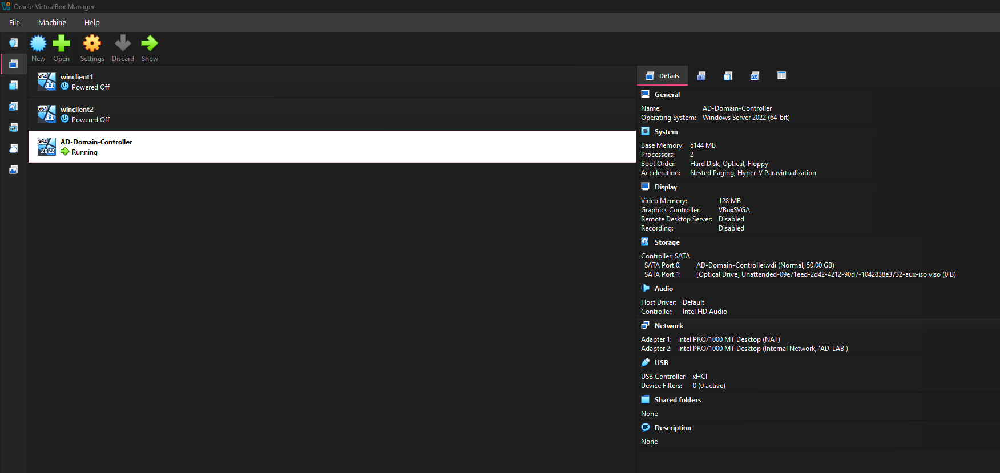
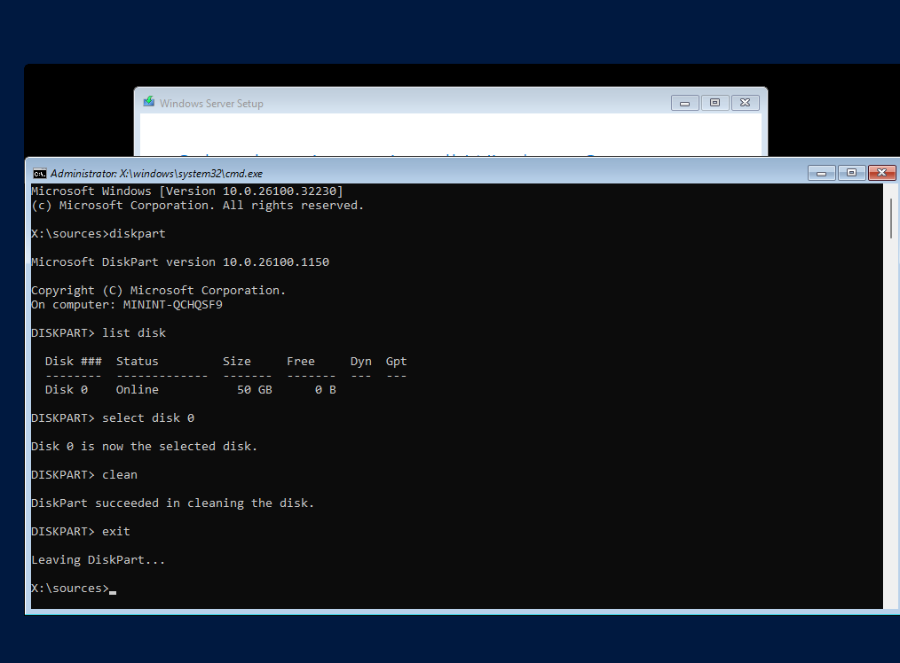
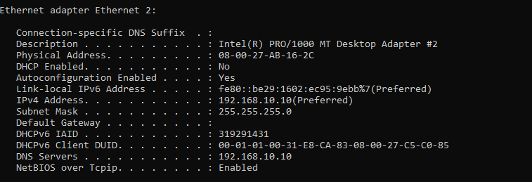
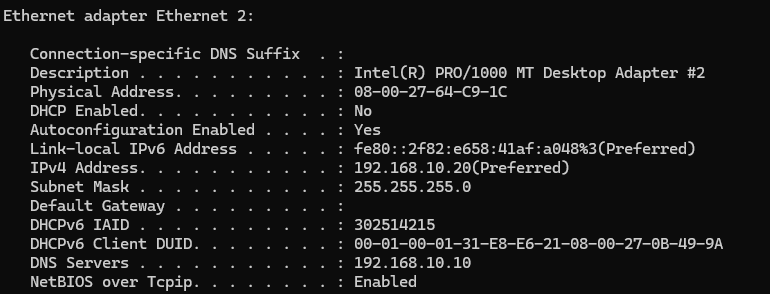
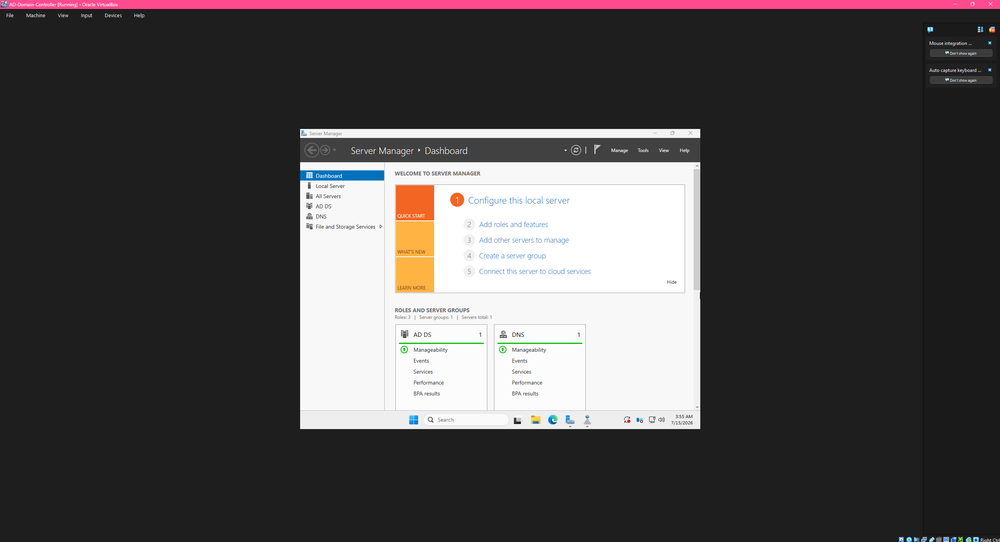

# Active-Directory-Home-Lab
Built a Windows Server Active Directory environment with domain-joined Windows clients.

- Downloaded Oracle VirtualBox and setup Windows Server and Windows client VM's.
- Setup an internal network so the server and clients could communicate. 
- Setup a static IP address and had the server point the DNS to itself.
- Installed Active Directory Domain Services and promoted the server to Domain Controller.
- Created Organizational Units, User Accounts, and Security Groups.
- Joined the client PC to the domain and tested domain login.
- Created and modified Group Policies such as Password Policy, Security Policy, Software Installation
- Practiced help desk scenarios such as disabling users, resetting passwords, unlocking accounts, changing permissions, logon scripts, and software deployment.
- Performed troubleshooting using tools such as gpupdate, gpresult, ping, ipconfig, nslookup.

## Setup and Installation
Performed a setup of VMs and installation of Windows Server and Windows 11 clients. For the server, this required cleaning the disk using diskpart to free up space which allowed Windows Server to install.

## Network Setup
Configured the server and client VM network settings to enable a second adapter for an internal network. Configured the server network configuration to set the static IP address: 192.168.10.10. The client machine IP address was set to 192.168.10.20 to ensure the server and client were on the same local network. The server and client machines were both configured to have the DNS point to the server IP.

## Active Directory and DNS Server Setup
Installed Active Directory Domain Services and DNS Server. Promoted the server to a domain controller and gave it the domain name: campbell.local.

## OU, User Account, and Security Group Creation
